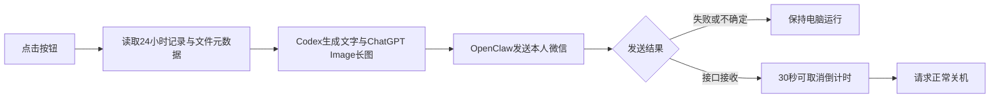

# 日报后关机 · macOS

点击按钮，回顾前 24 小时的电脑活动和文件变化，合并重要邮件、未来24小时日程与待办，生成中文文字日报与详细长图，经 OpenClaw 发送到本人微信，成功后倒计时 30 秒请求 macOS 正常关机。

也提供“仅发送日报，不关机”。生成图文需要数分钟，苹果菜单原生关机、合盖、强制断电不会触发此流程。



## 日报内容

- 具体活动与时间线，区分已完成、讨论中、后台记录。
- 可核实成果、重要文件变化，以及最多 3 项待续事项。
- Gmail/Outlook 近24小时重要来信（含已读变化）、近7天仍需处理的未读邮件，以及 Google Calendar 未来24小时日程。每次先核实连接账号，注明缺失、分页截断或账号不符；只读，不自动回复、建草稿、标记已读或修改日历。
- 一张信息充实的中文长图，包含约 500–800 字、七个内容区域。
- 覆盖范围和记录空档；不把事件数换算成工作时长，不推测空档期间的活动。

仓库只包含工作流源码和配置模板，不包含真实日报、活动记录、截图、微信身份、凭证、会话令牌或发送日志。

## 运行条件

- macOS 12+，Xcode Command Line Tools，Python 3.9+，Node.js 22+。
- 本机已登录的 Codex CLI；执行环境需要支持内置 ChatGPT Image 工具。没有该能力时会说明原因并降级为文字日报，不接入其他生图服务。
- Computer History 已启用并实际记录活动。工具读取本地事件文件与已有摘要；这些路径属于应用内部结构，后续版本可能变化。
- OpenClaw Gateway 正在运行，已连接 `openclaw-weixin`，账号绑定到本人私聊，并有近期有效会话上下文。
- 联网、可读的活动记录和文件目录。首次关机可能需要系统自动化权限；未保存文稿可能阻止关机。

此项目调用已有 Codex 和 OpenClaw，不包含它们的实现。已在原电脑验证真实文字和详细图片发送，收件人确认收到；通用版经过本地构建与回执逻辑测试，尚未在另一台电脑完成全流程测试，未执行真实关机测试。

## 安装

```bash
git clone https://github.com/yusongcao2004/mac-daily-shutdown.git
cd mac-daily-shutdown
python3 scripts/build_app.py
```

将 `build/日报后关机.app` 拖到个人 `Applications` 文件夹，再为它创建桌面替身。程序将后端源码包含在 app 内，不依赖原来的开发目录。构建时使用的 Python 路径会保存到应用；移动或删除该 Python 后需要重新构建。

查看本地 OpenClaw 的账号配置，选择你自己使用的微信账号 ID，然后运行：

```bash
python3 scripts/configure.py --account YOUR_OPENCLAW_WEIXIN_ACCOUNT
```

配置写入 `~/Library/Application Support/DailyShutdown/config.json`，初始 `approved` 为 `false`。阅读下方数据说明，确认后在本地改为 `true`；也可在配置命令添加 `--approve` 明确授权。配置脚本不会复制登录凭证。

本地配置中的 `scan_roots` 默认是桌面、文稿、下载，按需加入项目目录。Codex 默认使用 `codex_binary: "auto"`，每次运行比较桌面应用内置版本与独立 CLI，选择本机可运行的较新版本，继续使用现有模型设置。显式填写路径时尊重该路径；如提示模型需要新版 Codex，请更新该安装或改回 `auto`。所用路径及版本记在本次 `runtime.json`。

核对 `timezone`（默认 `Europe/Berlin`）、`codex_binary`、`openclaw_binary`。可选 `history_segments`、`history_summaries`、`openclaw_home`、`codex_home` 覆盖默认路径。

在手机微信给已连接的机器人发一句话刷新会话，然后先使用“仅发送日报，不关机”确认效果，再使用关机按钮。

邮件与日程采集依赖 Codex CLI 环境中的 Gmail、Outlook Email 和 Google Calendar 连接器。连接器缺失时，其他日报内容仍生成，但必须明确标注覆盖不完整。可在本地配置加入 `mail_brief.expected_accounts`（键为 `gmail`、`outlook`、`calendar`）验证预期账号，以及可选 `mail_brief.legacy_brief_path` 指向只读旧简报以迁移去重上下文。后续使用本地已送达运行中的 `mail-brief.json` 去重，不修改旧任务或长期记忆。邮件配置、内容、账号身份和日程仅保存在本地。

## 命令行

```bash
# 仅生成本地预览，仍会调用 Codex/ChatGPT Image
python3 src/runner.py --mode preview

# 生成并发送；CLI 本身永远不调用关机
python3 src/runner.py --mode send
```

默认工作目录为 `~/Library/Application Support/DailyShutdown/`：`reports/` 保存交付，`runs/` 保存证据、生成结果与回执，`daily-report-state/` 保存扫描快照。可用 `DAILY_SHUTDOWN_HOME` 环境变量指定另一个本地目录。

## 数据、发送与限制

通过连接器取得的邮件与日程必要摘要、活动摘录、应用和窗口标题、必要输入片段、文件路径和少量相关文本会交给已登录的 Codex 服务处理；概括后的事实交给 ChatGPT Image；最终图文通过微信发送。代码会排除常见凭证路径、缓存、依赖和构建目录，但启发式过滤不能保证识别所有敏感内容，请把扫描范围设置为愿意用于日报的目录。

扫描默认只读元数据，对少量文本文件读取内容，不强制下载云端占位文件。文件时间戳只能说明时间线索，不证明具体内容差异；首次扫描没有旧快照，无法还原此前删除或逐行变化。符号链接、应用包和照片图库排除；记录不可用时停止，摘要缺失时只能使用已采集的事件摘录。

每次发送核对账号本人身份、OpenClaw 路由和服务端点，并复用 Gateway 保存的会话上下文；不修改现有机器人路由。发送校验钩子仅加载到这次 CLI 进程，不改动已安装的插件。

回执支持零返回码、空 JSON 成功对象以及非空服务端 `message_id`；任何非零错误码都会失败。接口接收不代表收件人已读。文字或图片发送结果不确定时保留电脑运行，保留日志，不自动重试；已发送的消息无法撤回。生成图片失败时可发送文字日报，图片发送失败时不关机。

正常点击会生成新的日报。`--prepared` 仅供人工排错：同一运行中已确认接收的部分跳过，存在未确认的尝试则停止。不要通过删回执强行重试；先核对微信是否已收到。

长期日志和快照可能包含个人信息，保存在本地且没有自动清理策略。不要将运行目录或真实配置放进 Git。此版本不安装定时任务；触发入口是 app 按钮。

## 验证

```bash
node tests/test_sender.mjs
python3 -m unittest discover -s tests -p 'test_*.py'
```

测试使用临时目录及模拟响应，不访问真实微信、不发送消息、不关机。

参考依赖：[OpenClaw](https://github.com/openclaw/openclaw)、[Tencent openclaw-weixin](https://github.com/Tencent/openclaw-weixin)。

## 开源许可

本项目采用 [MIT License](LICENSE)，欢迎查看、下载、使用、修改和分发。第三方工具及服务仍适用各自的许可证与服务条款。

无需 Git 即可在仓库页面点击 **Code → Download ZIP** 下载源码；macOS 应用需按上面的步骤在本机构建。
